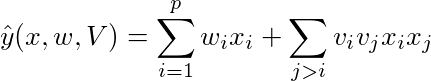
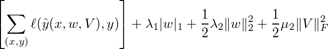

# Distributed Factorization Machine

For a *p* dimension example *x*, FM models the data by



where *w_i* denotes by the i-th element of the *p*-length vector *w*, and *v_i*
denotes by the i-th row of the *p*-by-*k* matrix *V*.

Given training data pairs *(x,y)*, FM learns the model
*w* and *V* by solving the following objective:

<!-- \left[\sum_{(x,y)} \ell(\hat y(x,w,V), y)\right] + \lambda_1 |w|_1 + \frac{1}{2} \lambda_2
\|w\|_2^2 + \frac{1}{2} \mu_2 \|V\|_F^2 -->



Here *ℓ* is the loss function such as logistic loss.

## Quick start

```
sh run_local.sh
```
### Dump format

```
key    size of (w+V)    w    V    sqc_grad for w  
eg: (embedding dim = 5) 
-2305843009213693952    6       -0.03293        -0.0278837      0.0185506       0.0244256       0.0273103       0.0175875       9.58451  
-4611686018427387904    6       -0.0236518      -0.00644252     0.015258        0.0128172       0.00233367      0.00965392      13.9504  
4971973988617027584     6       -0.0430204      -0.0335342      0.033125        0.026836        0.0449869       0.0152602       42.607  
-8718968878589280256    6       0.0254016       0.0383491       -0.0410308      -0.0369674      -0.0393771      -0.0312762      125.593  
2738188573441261568     6       -0.0487091      -0.0535223      0.0439216       0.0499866       0.0387711       0.0369372       22.7477  
```


## More
- Configuration: [difacto](../../doc/learn/difacto.rst)
- [Tutorial for the Criteo Kaggle CTR competition](http://wormhole.readthedocs.org/en/latest/tutorial/criteo_kaggle.html)
- [User Guide](http://wormhole.readthedocs.org/en/latest/learn/difacto.html)
