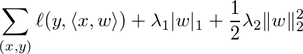

# Linear Method

Given data pairs *(x,y)*, the linear method learns the model vector *w* by
minizing the following objective function:



where *ℓ* is the loss function such as logistic loss and hinge loss.

## Quick start

```
sh run_local.sh
```

### Dump format

```
key    weight  
eg:  
76      -0.0548334  
29      0.323034  
47      0.0258198  
0       -0.197926  
97      -0.0140397  
```

## More

- Configuration: [linear](../../doc/learn/linear.rst)
- [Tutorial for the Criteo Kaggle CTR competition](http://wormhole.readthedocs.org/en/latest/tutorial/criteo_kaggle.html)
- [User Guide](http://wormhole.readthedocs.org/en/latest/learn/linear.html)
